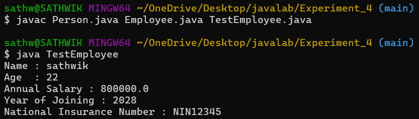
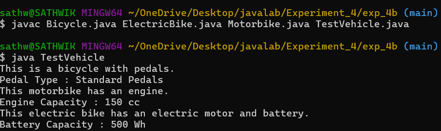
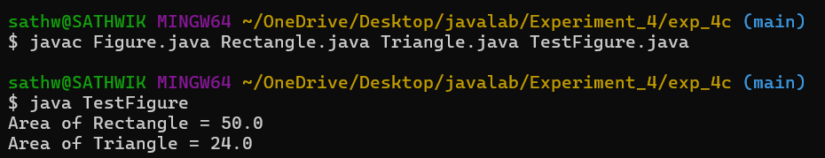

# Experiment
##AIM:
To write a JAVA program to implement Single Inheritance.
``` java
// Person.java
public class Person {
    String name;
    int age;

    // Constructor
    Person(String name, int age) {
        this.name = name;
        this.age = age;
    }

    // Method to display person details
    void displayPersonDetails() {
        System.out.println("Name : " + name);
        System.out.println("Age  : " + age);
    }
}


// Employee.java
public class Employee extends Person {
    double annualSalary;
    int yearOfJoining;
    String nationalInsuranceNumber;

    // Constructor
    Employee(String name, int age, double annualSalary, int yearOfJoining, String nationalInsuranceNumber) {
        super(name, age); // calling Person class constructor
        this.annualSalary = annualSalary;
        this.yearOfJoining = yearOfJoining;
        this.nationalInsuranceNumber = nationalInsuranceNumber;
    }

    // Method to display employee details
    void displayEmployeeDetails() {
        displayPersonDetails(); // inherited method
        System.out.println("Annual Salary : " + annualSalary);
        System.out.println("Year of Joining : " + yearOfJoining);
        System.out.println("National Insurance Number : " + nationalInsuranceNumber);
    }
}


// TestEmployee.java
public class TestEmployee {
    public static void main(String[] args) {

        Employee emp1 = new Employee(
                "Sai Karthik",
                22,
                450000.00,
                2024,
                "NIN12345"
        );

        emp1.displayEmployeeDetails();
    }
}

```
## output:


# Experiment 4b
## AIM: 
To write a JAVA program to implement Single Inheritance.
```java
// Bicycle.java
public class Bicycle {
    String pedalType;

    void showBicycleInfo() {
        System.out.println("This is a bicycle with pedals.");
        System.out.println("Pedal Type : " + pedalType);
    }
}


// Motorbike.java
public class Motorbike extends Bicycle {
    int engineCapacity;

    void showMotorbikeInfo() {
        System.out.println("This motorbike has an engine.");
        System.out.println("Engine Capacity : " + engineCapacity + " cc");
    }
}

// ElectricBike.java
public class ElectricBike extends Motorbike {
    int batteryCapacity;

    void showElectricBikeInfo() {
        System.out.println("This electric bike has an electric motor and battery.");
        System.out.println("Battery Capacity : " + batteryCapacity + " Wh");
    }
}


// TestVehicle.java
public class TestVehicle {
    public static void main(String[] args) {

        ElectricBike eBike = new ElectricBike();

        eBike.pedalType = "Standard Pedals";
        eBike.engineCapacity = 150;
        eBike.batteryCapacity = 500;

        eBike.showBicycleInfo();      // from Bicycle
        eBike.showMotorbikeInfo();    // from Motorbike
        eBike.showElectricBikeInfo(); // from ElectricBike
    }
}
```


## output:


#experiment 4c
##AIM:
To write a JAVA program to implement Single Inheritance.
``` java
// Figure.java
abstract class Figure {
    double dim1;
    double dim2;

    // Constructor
    Figure(double dim1, double dim2) {
        this.dim1 = dim1;
        this.dim2 = dim2;
    }

    // Abstract method
    abstract double area();
}

// Rectangle.java
class Rectangle extends Figure {

    // Constructor
    Rectangle(double length, double breadth) {
        super(length, breadth);
    }

    // Implementing abstract method
    double area() {
        return dim1 * dim2;
    }
}

// Triangle.java
class Triangle extends Figure {

    // Constructor
    Triangle(double base, double height) {
        super(base, height);
    }

    // Implementing abstract method
    double area() {
        return 0.5 * dim1 * dim2;
    }
}


// TestFigure.java
public class TestFigure {
    public static void main(String[] args) {

        Figure f1 = new Rectangle(10, 5);
        System.out.println("Area of Rectangle = " + f1.area());

        Figure f2 = new Triangle(8, 6);
        System.out.println("Area of Triangle = " + f2.area());
    }
}


```
## output:

